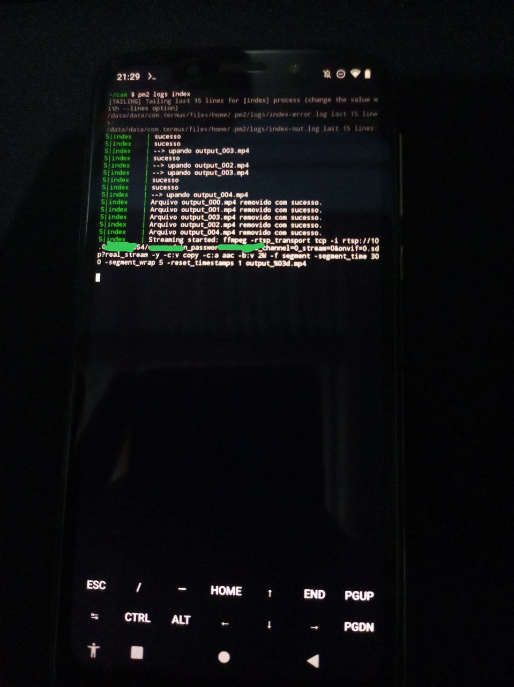
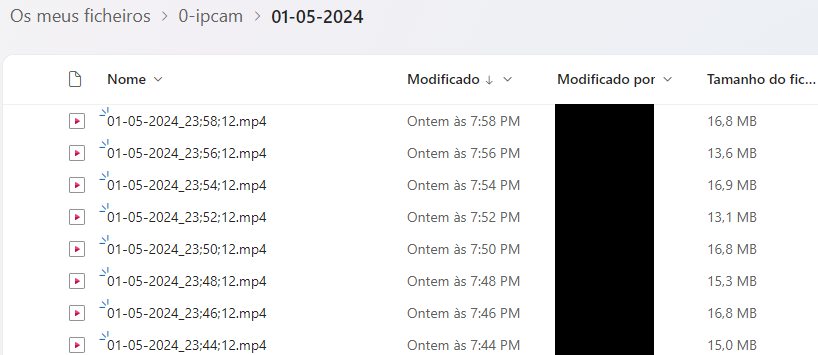

# IP Cam RTSP -> MP4 files
#### Projeto que converte a stream RTSP de uma câmera ip em arquivos mp4 e depois faz upload no telegram / Google Drive / OneDrive / outros
 

### Motivação:
Na necessidade de ter uma câmera de segurança em casa, comprei um modelo IP no Aliexpress por 80 reais.
 
 
Porém, para minha infelicidade, o app de controle da câmera é inútil para recuperar gravações do cartão de memória colocado na câmera. O app também possui planos pagos para armazenar as gravações em uma nuvem própria da marca, mas achei problemático depender de serviços fora do meu controle pra armazenar conteúdo sensível como gravações de segurança.
 
 
Por conta disso, busquei formas de armazenar as gravações em outro lugar gratuito facilmente acessível.
 
 
Esse projeto surgiu dessa necessidade.
 
 

### Como funciona:
Esse projeto foi feito em node.js usando FFMPEG para receber a Stream RTSP e converter em arquivos mp4. os arquivos mp4 são gerados automaticamente e substituídos em loop.
 
O código inicia o FFMPEG, e fica monitorando os arquivos gerados para enviar para as clouds suportadas.

 

### Serviços atualmente suportados:
- Telegram
 
Inicialmente cogitei usar o Telegram como armazenamento de gravações. Funciona bem, o player do app é muito bom, porém achei problemática a velocidade de download dos arquivos e o formato de chat não me pareceu interessante para gerenciar os milhares de arquivos que seriam gerados. Mas o Telegram é uma ótima opção caso você não tenha outras alternativas de cloud.

 
 
 
 

- Google Drive
 
Sem duvidas a melhor opção considerando todas as qualidades que o google drive possui. O player de vídeo é excelente e é muito simples gerenciar os arquivos, fazer download e compartilhar, acessível de qualquer lugar.
 
Porém... O espaço reduzido de apenas 15GB em uma conta Free é um problema, já que em meus testes, apenas 12h de gravação já ocupava 13GB em disco.
 
Cogitei usar os Team Drives que tem de graça pela internet, mas por ser um armazenamento controlado por uma organização, todos os dados armazenados neles são acessíveis pelos admins das contas, zero privacidade. Mas sem dúvida é a melhor opção se você tiver bastante armazenamento.

 
 
 
 

- OneDrive
 
Chegamos a opção que uso atualmente, consegue ter uma boa gerencia de arquivos, um player agradável, e bastante espaço disponível (usando uma conta Dev que fornece 5TB).
 
Unica critica a esse cloud é que a API para enviar os arquivos tem upload lento e precisa fazer um verdadeiro malabarismo pra conseguir gerar os tokens de acesso (que são 2).

 
 
 
 

- Rclone (O canivete suíço dos cloud storage)
 
Tem uma adaptação no código para usar o rclone caso você queira usar outra cloud / storage para guardar os arquivos mp4, mas pra isso você vai precisar fazer as modificações e adaptações, o código desse projeto está adaptado para usar o OneDrive via rclone e via api oficial.

 
 
 
 

### Instalação:

1 - Clone esse projeto e instale as dependências com `npm i`
 
 
2 - Defina a Host RTSP que você deseja usar dentro de `index.js`
 
 
3 - Configure o tamanho em minutos que cada arquivo individual terá, dentro de `index.js` > `segmentTimeSize=300`(5min)
 
 
4 - Instale o FFMPEG no sistema.
 
 
5 - Configure o cloud que você usará:
- Telegram
 
Crie um bot no telegram com o BotFather.
 
Configure o bot para permitir acessar configurações de canais.
 
Crie um canal no telegram, adicione o bot nele e pegue o ID do canal (ex: -100999999...).
 
Acesse o arquivo `telegram.js` e adicione o token do bot e o ID do canal.
 
No arquivo `index.js`, faça o import da função `SendVideo` fornecida pelo `telegram.js` e remova o comentário que chama a função dentro do laço for no fim do arquivo `index.js`

 
 
 
 

- Google Drive
 
Acesse o console de API do google e ative a api do google drive.
 
Crie um `service_account` e baixe o json, armazene o json na raiz do projeto com o nome `creds.json`.
 
Acesse o arquivo `googledrive.js` e cole o ID da pasta que você deseja salvar os arquivos em `const folderID=` (Dica: abra a pasta no google drive pelo navegador e copie o código após `drive/u/0/folders/>ID<`)
 
No arquivo `index.js`, faça o import da função `uploadFileToDrive` fornecida pelo `googledrive.js` e remova o comentário que chama a função dentro do laço for no fim do arquivo `index.js`

 
 
 
 

- OneDrive
 
Esse é chato de configurar.
 
Siga esse tutorial: [Retrieving Access Token From OneDrive using Google Apps Script](https://gist.github.com/tanaikech/d9674f0ead7e3320c5e3184f5d1b05cc)
 
No fim do tutorial, pegue o `refreshToken`, o `clientID` e o `clientSecret` e adicione no arquivo `onedrive.js`
 
Modifique a pasta que voce quer usar no onedrive no arquivo `onedrive.js` `const onedriveFolder =`

 
 
 
 

- Rclone
 
Instale o Rclone no sistema e configure a cloud que você deseja usar para salvar os arquivos (sugiro pesquisar como funciona o rclone primeiro antes de fazer isso)
 
Use o arquivo `rclone-onedrive.js` como base para configurar. Na linha 37, modifique o comando para usar a cloud que você configurou no rclone.

 
 
 
 

6 - Com tudo configurado, escolha onde você irá executar o projeto.
O projeto pode ser executado com Docker ou com PM2 e está adaptado para funcionar no Termux.

7 - Execute `node index.js`

 
 

### Funcionando no Termux:

#### Estou executando esse projeto em um Moto g7 play via Termux (celular parado sem uso e com baixissimo consumo de energia)

 
 
 

 
Exemplo de arquivos salvos no OneDrive

 
 
 

 
Exemplo de arquivos salvos no OneDrive

 
 
 
 

### Projeto ainda em desenvolvimento, código não está perfeito.
- sinta se a vontade para contribuir! 🤜🤛
